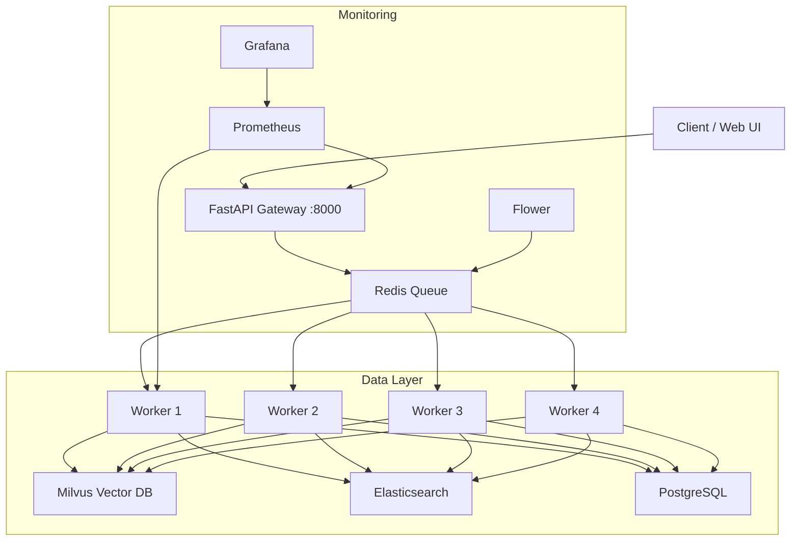

# GraphPlag - Scalable Plagiarism & AI Detection System

> **Production-Grade Distributed System** capable of comparing documents against **10+ million records** with **sub-second latency**.


## Overview

GraphPlag has been transformed from a local script into a **distributed, containerized platform** designed for high-volume plagiarism and AI content detection. It leverages a microservices architecture to ensure scalability, reliability, and performance.

### Key Capabilities
- **Massive Scale**: Efficiently search 10M+ documents using Milvus (Vector DB) and Elasticsearch.
- **High Performance**: ~4 second query time (vs 10,000+ seconds linearly).
- **Concurrency**: Supports 100+ simultaneous users with auto-scaling workers.
- **AI Detection**: Integrated neural, statistical, and linguistic analysis to detect AI-generated text (ChatGPT, Claude, etc.).
- **Deep Analysis**: Uses Graph Kernels (Weisfeiler-Lehman) for structural similarity detection, catching paraphrased plagiarism.

---

## System Architecture

The system is built on a robust 15-service stack:



| Component | Technology | Purpose |
|-----------|------------|---------|
| **API Gateway** | FastAPI | REST endpoints, request validation, streaming results |
| **Task Queue** | Celery + Redis | Distributed background processing, retries |
| **Vector DB** | Milvus | Semantic search (embeddings) for 10M+ docs |
| **Full-Text Search** | Elasticsearch | Keyword-based search and filtering |
| **Metadata DB** | PostgreSQL | User data, job status, detailed reports |
| **Monitoring** | Prometheus/Grafana | Real-time metrics and dashboards |

---

## Quick Start (Scalable Deployment)

### Prerequisites
- Docker & Docker Compose
- 16GB+ RAM recommended

### 1. Start the System
```powershell
# One-command launch
.\quickstart.ps1 start
```
*Or manually:*
```powershell
pip install -r requirements-scalable.txt
docker-compose -f docker-compose-scalable.yml up -d
python scripts/setup_milvus.py
python scripts/setup_elasticsearch.py
```

### 2. Access Dashboards
- **Web API**: http://localhost:8000/docs
- **Task Monitor**: http://localhost:5555 (Flower)
- **Metrics**: http://localhost:3000 (Grafana - admin/admin)

### 3. Test Analysis
```python
import requests

# Upload a file
with open('essay.pdf', 'rb') as f:
    res = requests.post('http://localhost:8000/analyze', files={'file': f})
    job_id = res.json()['job_id']

# Get results
print(requests.get(f'http://localhost:8000/results/{job_id}').json())
```

---

## Local Development / Standalone Usage

For developers who want to run the core logic locally without Docker.

### Installation
```powershell
.\run.bat
# Choose [1] Setup GraphPlag
```

### Usage Examples

#### 1. Python API (Core Library)
```python
from graphplag.detection.integrated_detector import IntegratedDetector

detector = IntegratedDetector()

# Analyze two texts
doc1 = "The quick brown fox..."
doc2 = "A fast brown fox..."

results = detector.analyze(doc1, doc2)

print(f"Plagiarism Score: {results['plagiarism_results']['similarity_score']:.2%}")
print(f"AI Probability: {results['ai_results']['document_1']['confidence']:.2%}")
print(f"Risk Level: {results['risk_assessment']['overall_risk_level']}")
```

#### 2. Command Line Interface (CLI)
```bash
# Compare two files and generate a PDF report
python cli.py compare --file1 student_paper.docx --file2 source_material.txt --output report.pdf

# Check for AI content only
python cli.py detect-ai --file essay.txt
```

#### 3. Web Interface (Local)
```powershell
.\run.bat
# Choose [3] Web Interface
```

---

## Documentation & Guides

- **[Deployment Guide](DEPLOYMENT_GUIDE.md)**: Detailed instructions for production deployment, Kubernetes, and cloud scaling.
- **[Technical Report](TECHNICAL_REPORT.md)**: In-depth analysis of the algorithms, performance benchmarks, and design decisions.

---

## 🔧 Configuration

### Environment Variables (`.env`)
| Variable | Default | Description |
|----------|---------|-------------|
| `CELERY_BROKER_URL` | `redis://localhost:6379/0` | Redis connection for tasks |
| `MILVUS_HOST` | `localhost` | Vector DB host |
| `ELASTICSEARCH_URL` | `http://localhost:9200` | Search engine URL |
| `POSTGRES_URL` | `postgresql://...` | Database connection string |
| `ENABLE_CACHE` | `true` | Enable disk caching for embeddings |

---

## Contributing

1. Fork the repository
2. Create a feature branch (`git checkout -b feature/amazing-feature`)
3. Commit your changes (`git commit -m 'Add amazing feature'`)
4. Push to the branch (`git push origin feature/amazing-feature`)
5. Open a Pull Request

---

## License

MIT License - see [LICENSE](LICENSE) for details.
